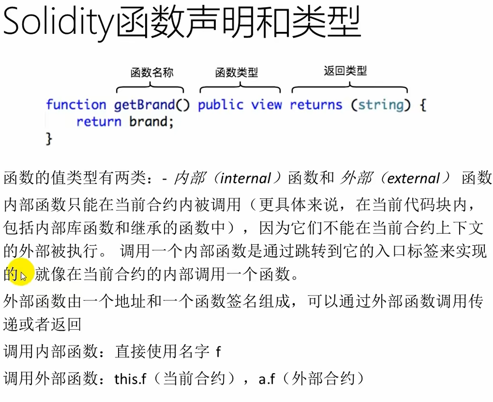

### Solidity源文件布局
- pragma(版本杂注)
- 源文件可以被版本 杂注pragma所注解，表明要求的编译器版本
- 例如:pragma solidity ^0.4.0;源文件将既不允许低于0.4.0版本的编译器编译，也不允许高于(包含)0.5.0版本的编译-器编译(第二个条件因使用^被添加)
- import(导入其它源文件)
- Solidity 所支持的导入语句import，语法同JavaScript(从ES6起)非常类似

### Solidity源文件布局--import
- import "filename"
 - 从“filename”中导入所有的全局符号到当前全局作用域中import * as symbolName from "filename",创建一个新的全局符号 symbolName，其成员均来自“filename中全局符号
- import {symbol1 as alias, symbol2} from "filename";
  - 创建新的全局符号 alias和symbol2，分别从"filename"引用symbol1 和 symbol2
- import "filename" as symbolName;
 - 这条语句等同于 import*as symbolName from "filename",

### Solidity值类型
 - 布尔(bool):可能的取值为字符常量值true或false
 - 整型(int/uint):分别表示有符号和无符号的不同位数的整型变量;支持关键字 uint8到uint256(无符号，从8位到256位)以及int8到int256，以8位为步长递增
 - 定长浮点型(fixed/ufixed): 表示各种大小的有符号和无符号的定长浮点型;在关键字ufixedMxN和fixedMxN中，M表示该类型占用的位数，N表示可用的小数位数
 - 地址(address):存储一个20字节的值(以太坊地址大小)
 - 定长字节数组:关键字有bytes1，bytes2，bytes3，.…，bytes32
 - 枚举(enum):一种用户可以定义类型的方法，与C语言类似，默认从0开始递增，一般用来模拟合约的状态
 - 函数(function):一种表示函数的类型

### Solidity引l用类型
 数组(Array)
- 数组可以在声明时指定长度(定长数组)，也可以动态调整大小(变长数组、动态数组)
- 对于存储型(storage)的数组来说，元素类型可以是任意的(即元素也可以是数组类型，映射类型或者结构体);对于内存型(memory)的数组来说，元素类型不能是映射(mapping)
    - 类型结构(Struct)
- Solidity 支持通过构造结构体的形式定义新的类型
    - 映射(Mapping)
- 映射可以视作表，在实际的初始化过程中创建每个可能的key，并将其映射到字节形式全是零的值(类型默认值)

### Solidity地址类型
address
- 地址类型存储一个20字节的值(以太坊地址的大小);地址类型也有成员变量，并作为所有合约的基础address payable(v0.5.0入)
- 与地址类型基本相同，不过多出了transfer和send 两个成员变量

两者区别和转换
- Payable 地址是可以发送ether 的地址，而普通 address 不能允许从 payable address 到 address 的隐式转换，而反过来的直接转换是不可能的(唯一方法是通过uint160来进行中间转换)
- 从0.5.0版本起，合约不再是从地址类型派生而来，但如果它有payable的回退函数，那同样可以显式转换为 address 或者 address payable 类型


### 地址类型成员变量
- <address>.balance(uint256)
 - 该地址的ether余额，以Wei为单位
- <address payable>.transfer(uint256 amount)
 - 向指定地址发送数量为amount的ether(以Wei为单位)，失败时抛出异常，发送2300gas的矿工费，不可调节
- <address payable>.send(uint256 amount) returns (bool)
 - 向指定地址发送数量为amount的ether(以Wei为单位)，失败时返回false，发送 2300 gas 的矿工费用，不可调节
- <address>.call(bytesmemory) returns (bool, bytes memory)
 - 发出底层函数CALL，失败时返回false，发送所有可用gas，可调节
- <address>.delegatecall(bytes memory) returns (bool, bytes memory)
 - 发出底层函数 DELEGATECALL，失败时返回false，发送所有可用gas，可调节
- <address>.staticcall(bytesmemory) returns (bool, bytes memory)
 - 发出底层函数 STATICCALL，失败时返回false，发送所有可用gas，可调节

### 地址成员变量用法
#### balance和transfer
- 可以使用 balance 属性来査询一个地址的余额，可以使用transfer 函数向一个payable地址发送以太币Ether(以 wei 为单位)
- - address payable x= address(0x123);address - - myAddress = address(this);if(x.balance<10 && myAddress.balance >= 10)x.transfer(10),;
#### send
- - send 是 transfer 的低级版本。如果执行失败，当前的合约不会因为异常而终止，但 send 会返回 false
#### call
- - 也可以用call来实现转币的操作，通过添加.gas()和.value()修饰器:nameReg.call.gas(1000000).value(1ether)(abi.encodeWithSignature("register(string)","MyName")),

### 字符数组(Byte Arrays)
#### 定长字符数组bytes32分别代表了长
- - 属于值类型，bytes1，bytes2，…，度为1到32的字节序列
- - 有一个.length属性，返回数组长度(只读)变长字符数组
- - 属于引用类型，包括bytes和string，不同的是bytes是Hex字符串，而string是UTF-8编码的字符串

### 枚举(Enum)
- 枚举类型用来用户自定义一组常量值
- 与C语言的枚举类型非常相似，对应整型值
```solidity
pragma solidity >=0.4.0 <0.8.17.
contract Purchase {
    enum State { 
        Created, Locked, Inactive 
}
```

### 数组(Array)
- 固定大小k和元素类型T的数组被写为Tk]，动态大小的数组为TI]。例如，一个由5个uint动态数组组成的数组是uint[][5]
- 要访问第三个动态数组中的第二个uint，可以使用x[2][1]
- 越界访问数组，会导致调用失败回退
- 如果要添加新元素，则必须使用.push()或将.length增大
- 变长的storage数组和bytes(不包括string)有一个push()方法。可以将一个新元素附加到数组末端，返回值为当前长
度

#### 数组示例
```solidity
pragma solidity >=0.4.16 <0.8.17;
contract C {
    function f(uint len) public pure {
        uint[] memory a = new uint[](7);bytes memory b = new bytes(len);
        assert(a.length == 7);
        assert(b.length == len);
        a[6]= 8;
    }
}
```


### 结构(Struct)
- 结构类型可以在映射和数组中使用，它们本身可以包含映射和数组。
- 结构不能包含自己类型的成员，但可以作为自己数组成员的类型，也可以作为自己映射成员的值类型
```solidity
pragma solidity >=0.4.0 <0.8.17;
contract Ballot {
    struct Voter {
            uint weight;
            bool voted;
            uint vote;
    }
}
```

### 映射f(Mapping)
- 声明一个映射:mapping(KeyType=>_ValueType)
- KeyType可以是任何基本类型。这意味着它可以是任何内置值类型加上字符数组和字符串。不允许使用用户定义的或复杂的类型，如枚举，映射，结构以及除bytes和string之外的任何数组类型。
- ValueType可以是任何类型，包括映射。
```solidity
pragma solidity >=0.4.0 <0.8.17.0;
contract MappingExample {
    mapping(address => uint) public balances;function update(uint newBalance) public {
        balances[msg.sender]=newBalance;
    }
    function update(address account,uint newBalance) public {
        balances[account]=newBalance;
    }
}
contract MappingUser {
    function f() public returns (uint) {
        MappingExample m= new MappingExample();m.update(100);
        m.update(200);
        return m.balances(address(this));
    }
}
```

### Solidity数据位置
- 所有的复杂类型，即数组、结构和映射类型，都有一个额外属性，“数据位置”，用来说明数据是保存在内存memory中还是存储storage
- 根据上下文不同，大多数时候数据有默认的位置，但也可以通过在类型名后增加关键字storage 或memory 进行修改
- 函数参数(包括返回的参数)的数据位置默认是memory，局部变量的数据位置默认是 storage，状态变量的数据位置强制是storage
- 另外还存在第三种数据位置，calldata，这是一块只读的，且不会永久存储的位置，用来存储函数参数。外部函数的参数(非返回参数)的数据位置被强制指定为 calldata，效果跟 memory 差不多

### 数据位置总结
- 强制指定的数据位置
- 外部函数的参数(不包括返回参数):calldata;
- 状态变量:storage
- 默认数据位置
- 函数参数(包括返回参数):memory;引用类型的局部变量:storage值类型的局部变量:栈(stack)
- 特别要求
- 公开可见(publicly visible)的函数参数一定是memory 类型，如果要求是storage 类型则必须是 private 或者internal 函数，这是为了防止随意的公开调用占用资源

### //一个简单的例于
```solidity
    pragma solidity ^0.8.0;
    contract C {
        uint[] data1;
        uint[] data2;
        function appendOne() public {
            append(data1);
        }   
        function appendTwo() public {
            append(data2);
        }
        function append(uint[] storage d) internal {
            d.push(1);
        }
}
```
### //下面代码编译错误
```solidity
pragma solidity ^0.8.0;
contract C {
    uint[] x;
    function f(uint[] memoryArray) public {
        x= memoryArray;
        uint[] y= x;
        y[7];
        y.length = 2;delete x;
        y= memoryArray,
        delete y;
        g(x);
        h(x);
    function g(uint[] storage storageArray) internal {}
    function h(uint[] memoryArray) public {} 
}
```


### Solidity函数可见性
- 函数的可见性可以指定为external，public，internal 或者 private;对于状态变量，不能设置为external，默认是internal。
- external:外部函数作为合约接口的一部分，意味着我们可以从其他合约和交易中调用。一个外部函数f不能从内部调用(即f不起作用，但 this.f()可以)。当收到大量数据的时候，外部函数有时候会更有效率。
- public:public函数是合约接口的一部分，可以在内部或通过消息调用对于 public 状态变量，会自动生成一个 getter 函数。
- internal:这些函数和状态变量只能是内部访问(即从当前合约内部或从它派生的合约访问)，不使用this 调用。
- private:private 函数和状态变量仅在当前定义它们的合约中使用，并且不能被派生合约使用。

### Solidity函数状态可变性
- pure:纯函数，不允许修改或访问状态
- 不允许修改状态view:
- payable:允许从消息调用中接收以太币Ether
- constant:与view相同，一般只修饰状态变量，不允许赋值(除初始化以外)
#### 以下情况被认为是修改状态:
- 修改状态变量。
- 产生事件。
- 创建其它合约。
- 使用 selfdestruct。
- 通过调用发送以太币。
- 调用任何没有标记为 view 或者 pure 的函数。
- 使用低级调用。
- 使用包含特定操作码的内联汇编。
#### 以下被认为是从状态中进行读取:
- 读取状态变量。
- 访间 this.balance 或者<address>.balance。
- 访问 block，tx，msg 中任意成员(除msg.sig和 msg.data 之外)
- 调用任何未标记为 pure 的函数。
- 使用包含某些操作码的内联汇编


### 函数修饰器(modifier)
- 使用修饰器modifier 可以轻松改变函数的行为。例如，它们可以在执行函数之前自动检查某个条件。修饰器modifier是合约的可继承属性，并可能被派生合约覆盖
- 如果同一个函数有多个 修饰器modifier，它们之间以空格隔开，修饰器modifier 会依次检查执行。

### 回退函数(fallback)
- 回退函数(fallback function)是合约中的特殊函数;没有名字，不能
- 有参数也不能有返回值
- 如果在一个到合约的调用中，没有其他函数与给定的函数标识符匹配(或没有提供调用数据)，那么这个函数(fallback函数)会被执行
- 每当合约收到以太币(没有任何数据)，回退函数就会执行。此外为了接收以太币，fallback函数必须标记为payable。如果不存在这样的函数，则合约不能通过常规交易接收以太币
- 在上下文中通常只有很少的 gas 可以用来完成回退函数的调用，所以使falback 函数的调用尽量廉价很重要